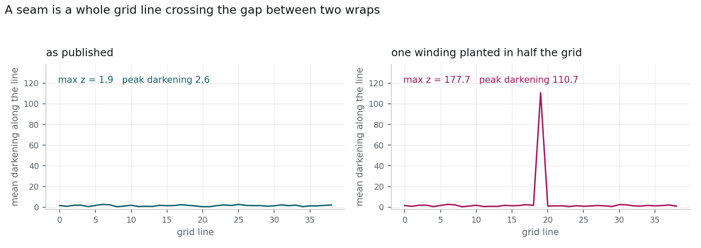
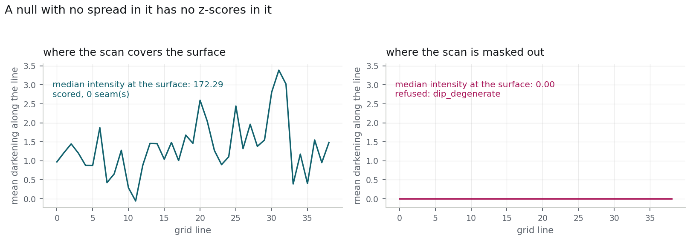

# labelscope

**A diagnostic scope for Vesuvius Challenge surface-label datasets.**

The [Open Problems](https://scrollprize.org/2026_open_problems) post names label
quality as one of the main unwrapping bottlenecks, and describes the failure
modes in words:

> Those labels often come from human-generated meshes or annotations —
> enormously valuable, but approximate. They may wiggle. They may drift slightly
> off the true surface. They may avoid the most ambiguous regions.

Those are three testable claims, and nothing in the pipeline currently measures
them. `labelscope` turns each one into a number you can compute on a dataset you
already have, on a CPU, in minutes — and, where it finds a problem, emits the
artifact that fixes it rather than just a complaint.

It answers three questions:

| Question | Command | What comes out |
|---|---|---|
| Is my train/validation split honest? | `labelscope leakage` | leak percentage + a drop-in `splits_final.json` that removes it |
| Are the labels internally consistent? | `labelscope scan` | class-scheme, shape, encoding and topology census; ranked worst volumes |
| Do the labels sit where the CT says the surface is? | `labelscope align` | signed offset from the label to the scan's own ridge, in voxels |
| Has this traced surface jumped to a neighbouring wrap? | `labelscope sheetswitch` | the grid lines (or, on a triangular mesh, the cut) where it does, and a refusal when the resolution cannot tell |

---

## Install

```bash
python -m pip install --upgrade pip     # needs pip >= 21.3 for a pyproject-only install
pip install -e .                        # Python >= 3.9, CPU only, no GPU required
labelscope --version
```

Optional extras: `.[zarr]` to read Zarr and OME-Zarr as well as 3-D TIFF, `.[dev]`
for the test suite.

```bash
pytest -q          # 110 tests, well under a minute, no data download required
```

Every test builds its own synthetic volumes, so the suite runs on a clean clone
with nothing fetched.

---

## 1. `labelscope leakage` — is the validation score real?

Patch datasets cut on a sliding window can share voxels between patches. When
they do, a random k-fold split puts the same voxels on both sides of the split
and the validation score that follows is optimistic — which matters, because that
score is what checkpoint selection and loss-variant comparisons are decided on.

```bash
labelscope leakage --labels nnUNet_raw/DatasetXXX/labelsTr --k 5 --out audit/
```

```
read 1754 patch shapes from the volumes: 4 distinct — [(170,170,170), (172,172,172), (236,236,236), (300,300,300)]
1754 patches, 28 overlapping pairs (1.8% of patches)
nnU-Net default split: 1.5% of validation patches leak (random shuffles: 1.6%)
blocked split: val folds [351, 351, 351, 351, 350], 0 residual leaks, 0.1% dropped to buffer
```

**It reads every volume's real shape rather than trusting the name.** This is not
a nicety. `Dataset059` names look uniform — `s1_z10240_y2560_x2560` carries only
an origin — and the directory holds 170³, 172³, 236³ and 300³ cubes. Assuming
300³ turns 28 overlapping pairs into 7,527 and a 1.5% leak into 91.9%. That
mistake is in this repository's history; `--assume-patch-size` reproduces it, and
two tests pin the difference.

What it reports:

* `overlapping_pairs`, and the share of patches touching another;
* the leak in **the split nnU-Net actually generates** —
  `generate_crossval_split(sorted_keys, seed=12345, n_splits=5)`, i.e.
  `sklearn KFold(5, shuffle=True, random_state=12345)` — not just an average over
  hypothetical shuffles;
* with `--measure-seen`, the leak **in voxels**: for each validation patch, the
  fraction of its labelled surface that a training patch also covers. That is an
  upper bound on how much of the target is reproducible from memory alone, and it
  needs no GPU and no training run;
* with `--consistency N`, whether overlapping patches **agree** about the voxels
  they share. They should — it is the same physical papyrus, labelled once.

And it writes `splits_final.json` in nnU-Net's own format. Drop it into
`nnUNet_preprocessed/DatasetXXX/` and the next run uses a split where no
validation patch touches a training patch.

Two strategies, both leak-free:

* `--mode block` (default) — **spatial block cross-validation**. Each source
  volume is tiled into blocks larger than the largest patch and whole blocks are
  dealt to folds, so validation folds stay near-equal in size. Any training patch
  that would still touch a validation patch is dropped into a buffer zone.
* `--mode component` — whole connected components of the overlap graph go to one
  fold. Nothing is discarded, but fold sizes follow component sizes.

`--buffer N` widens the definition of contamination: two patches that stop `N`
voxels short of each other still count as neighbours, because the same papyrus
sheet almost certainly runs through both.

If the volumes are not on this machine, `--names-file names.txt` works — but then
the patch size has to be assumed, with the consequences above.

## 2. `labelscope scan` — what is actually in this release?

```bash
labelscope scan --labels labelsTr --images imagesTr --out audit/
labelscope scan --labels labelsTr --headers-only --out audit/   # never decodes voxels
```

Per volume it reports shape, dtype, on-disk encoding, the class values actually
used, and — per class, not lumped together — foreground fraction, local
thickness, connected components, fragment fraction and planarity.

**Labels here are not binary.** The releases seen so far carry a thin
writing-surface class alongside a bulky region class. Averaging sheet thickness
over `label > 0` produces a number that means nothing, so every metric is
computed per class and the sheet-like class is *identified* rather than assumed:
the thin, planar, non-space-filling one.

What the metrics are for:

* **thickness** (twice the Euclidean distance transform) — a traced writing
  surface is a couple of voxels thick and tightly distributed. A fat upper tail
  is where a label has swallowed the gap between two windings.
* **planarity** (smallest PCA eigenvalue of a component, as a share of the total)
  — 0 for a perfect plane, 1/3 for an isotropic blob.
* **fragment fraction** — how much of the label is in pieces too small to be a
  sheet.
* **branch points** (`--deep`, skeletonises each label) — a single sheet
  skeletonises with no interior junctions. Junctions mean the label forks, most
  often because it has bridged two windings — the error the Open Problems post
  calls unrecoverable downstream, because "a small local error can send a traced
  mesh onto the wrong wrap entirely".

---

## 3. `labelscope align` — does the label sit on the ridge?

```bash
labelscope align --images imagesTr --labels labelsTr --out audit/ --overlays 10
```

### The measure that does not work, and how we know

The obvious way to ask "is this label on the sheet?" is to walk along the surface
normal from each labelled voxel and find the nearest intensity maximum. On
carbonised papyrus that number is meaningless, and it is meaningless in a way you
can demonstrate in one command. Sweeping the search radius on `sample_00004` of
the Kaggle surface release, with the label held fixed:

| search radius (vx) | 2 | 3 | 4 | 6 | 9 |
|---|---|---|---|---|---|
| median \|offset\| (vx) | 0.70 | 1.15 | 1.53 | 2.18 | 3.09 |

The measured "drift" tracks the window. A real displacement would plateau once
the window exceeded it. It does not, because along any one normal there are fibre
maxima, both faces of the sheet, and — at a winding period of roughly 14 to 27
voxels in this release — the neighbouring wrap. An argmax picks among them
essentially at random.

Reporting that number as label drift would have been wrong, confidently and
quantitatively wrong. `tests/test_aggregate.py` keeps the failure pinned as a
regression test, on a synthetic tuned so the naive estimator degrades there the
way it degrades on real data.

### The measure that does work

A single voxel's profile is hopeless; the *sheet* is not. Averaging the profiles
over a cube of labelled surface cancels the incoherent maxima and reinforces the
sheet. On the same patch, the mean profile over 6,000 labelled voxels is clean,
single-peaked, and centred at +0.00 voxels.

So `labelscope align` reports:

* **`global_peak_offset`** — the patch's offset from its own sheet, with a
  bootstrap 95% interval.
* **per-cell offsets** — one figure per `--cell`-sized cube of surface (64³ by
  default), each backed by at least `--min-per-cell` sampled voxels. This is the
  actionable output: it says *which region* of the patch is off, not just that
  something is.
* **`cell_frac_unresolved`** — cells whose averaged profile has no peak inside
  the window. They are counted and excluded, never quoted at the window edge,
  because quoting the edge invents a displacement the data does not contain.
* **`hf_energy_norm`** — a label-free difficulty proxy per patch, standing in for
  the compressed-region haze the Open Problems post describes, so the report can
  bin patches by difficulty and ask whether the labels are worse where the scroll
  is hardest.

The result is stable in the way the naive measure is not — across `R = 5…16` on
`sample_00004` the answer moves by 0.16 voxels while the naive one moves by 2.4:

| search radius (vx) | 5 | 7 | 9 | 12 | 16 |
|---|---|---|---|---|---|
| aggregated offset (vx) | +2.19 | +2.31 | +2.33 | +2.34 | +2.34 |

### Four traps, each now a test

Building this dragged out four defects that a synthetic with one clean sheet in
it would have let through:

1. **Normals from a distance-field gradient are degenerate on a thin open
   surface.** The field has a *minimum* at the sheet, so its gradient there is
   exactly zero. Replaced with local PCA over the label point cloud.
2. **Profiles walking outside the volume were clamped to the border value**,
   inventing a plateau that could outrank the real ridge. Out-of-bounds walks are
   now discarded.
3. **Polarity inferred from the profile assumes the label is already on the
   sheet** — which is the thing being measured. A label a few voxels off sits in
   the gap between wraps, reads darker than the window edges, and inverts the
   whole measurement. Polarity is a property of the modality, so it defaults to
   `bright` (papyrus is denser than the air between wraps) and `auto` is
   available with that caveat documented.
4. **Taking the tallest ridge attributes a displaced label to the neighbouring
   wrap**, turning a 5-voxel displacement into a 9-voxel one in the opposite
   direction. Among ridges above a prominence floor, the *nearest* wins.

`--radius auto` (the default) measures the local winding spacing from the scan
itself and keeps the search inside 45% of it, so it cannot reach the next wrap.
The spacing it measured is reported alongside every result.


## 4. `labelscope sheetswitch` — has this surface jumped to another wrap?

The Open Problems bottleneck table lists "Meshes can jump from one wrap to
another" and asks for conservative failure detection.
[villa#1621](https://github.com/ScrollPrize/villa/issues/1621) shows why the
spiral satisfaction metric cannot give it: the metric derives its target from the
patch's own position, so a patch displaced by any whole number of windings scores
identically to a correct one — a delta of exactly zero.

```bash
labelscope sheetswitch --mesh seg/*.tifxyz --volume https://.../volume.zarr \
                       --remote --window 160 --out audit/
```

A displaced surface still lies on papyrus, so nothing about the surface itself
gives it away. What does is the **seam**: the one line of grid edges that has to
cross the gap between two wraps, and the gap is dark.

 The statistic is the depth
of that trough relative to each edge's own endpoints, averaged along the seam
direction — a seam is about 1% of a mesh's edges, so judging edges individually
drowns it.

On a published PHercParis4 surface against its own 2.4 µm scan, one winding
planted over half the grid:

| | real mesh | one winding displaced |
|---|---|---|
| seam line mean darkening | 9.1 | **36.3** |
| **z-score** | **0.4** | **11.5** |

It fires at one, two and three windings alike — the periodicity the satisfaction
metric is blind to.

### It refuses to answer when it cannot



**Where the scan is masked out**, the surface reads flat: every edge dips by
nothing, the spread collapses, and a robust z-score computed on that null will
report whatever rounding noise it finds. On the published surfaces that produced
the loudest result in a 56-surface sweep, z = 12.60 from a median line dip of
0.000. The detector now samples the scan at the surface first and reports
`dip_degenerate` instead of a seam. See [finding 8](findings/README.md).


The seam is only visible if a grid edge normally stays on one wrap. The detector
measures the winding spacing from the scan and reports `steps_per_winding`; below
two it moves its findings to `seams_unreliable` and reports none. In practice the
requirement is **voxel size < winding spacing / 40**, and it is per scroll: at
45.5 µm on Scroll 1 the grid step is ~18 voxels against a 12.5 voxel spacing, and
`PHerc0500P2` fails the test even at 9.362 µm because its wraps are physically
about 3.5× tighter.

### Reading a surface out of an 81 TB volume

`--remote` streams the scan chunk by chunk, fetching only the chunks the surface
passes through. A traced surface is a 2-D sheet threaded through the scan, so that
is a small fraction of its own bounding box: about 4 GB of transfer per segment
against roughly 50 GB for the box, and the size of the full array — 75784 × 32693
× 32693 for PHercParis4 at 2.4 µm — never enters into it.

`--window N` measures the most complete N×N patch of each grid. Streaming cost
follows how much scroll a surface spans, not how many vertices are sampled, so
decimating a whole segment does not make it cheap and a contiguous window does.

`--decimate` is the trap. It cuts the number of samples, so it looks like a
saving — but the surviving vertices sit further apart, their normal walks touch
more distinct chunks, and the transfer goes **up**. Counted on a published
PHercParis4 surface, chunks needed for one pass:

| | `--window 96` | `--window 64` |
|---|---|---|
| `--decimate 1` | 1,127 (2.3 GB) | **539 (1.1 GB)** |
| `--decimate 2` | 1,579 (3.2 GB) | 736 (1.5 GB) |
| `--decimate 3` | 1,960 (3.9 GB) | 940 (1.9 GB) |

So `--window` is the lever for a fleet pass, and `--decimate` only helps when the
volume is already local.

### Triangular meshes, without a grid to lean on

`--mesh` also takes `.obj` and `.ply` files, the other formats surfaces are
exchanged in. The observation the detector rests on does not need a grid: two
vertices on the same sheet are joined by an edge that stays on papyrus, two
vertices on different wraps by an edge that crosses the dark gap. What the grid
provided was only a way to require the darkening be *collective*.

Without a grid that requirement has to be stated geometrically. Flagged edges are
grouped into connected components, and a component counts as a seam only if it
reaches across at least `--min-span` of the surface's own largest extent
(default 0.4) — **a sheet switch cuts across the surface; damage does not.**

The separation is not marginal. On the planted-displacement fixture:

| | largest component, edges | span fraction | `max_z` |
|---|---|---|---|
| a planted whole-winding switch | 95 | **1.00** | 84.4 |
| the same surface, clean | 13 | 0.15 | 11.3 |
| the same surface over a dark blob of damage | 16 | 0.16 | 21.1 |

The damage blob drives `max_z` to 21.1 — every edge crossing it is flagged — and
is still reported as no seam, which is the false positive the rule exists to
reject. The two detectors are
tested against each other on the same surface: both find the planted switch, both
report the clean surface clean.

```bash
labelscope sheetswitch --mesh surface.obj --volume scan.zarr --remote --out audit/
```

`--window` and `--decimate` are grid operations and apply to tifxyz only.

---

## Findings

`findings/` holds the reports this tool produced on public Vesuvius data, with
the exact commands used. See [findings/README.md](findings/README.md).

---

## Design notes

* **CPU only, no GPU, no training.** Every check runs on a laptop.
* **Header-only mode.** `scan --headers-only` inventories a release without
  decoding a voxel, so a multi-terabyte set can be checked before it is pulled.
* **Standard formats in, standard formats out.** Reads 3-D TIFF stacks
  (nnU-Net `imagesTr`/`labelsTr`), Zarr/OME-Zarr, tifxyz quad meshes and
  triangular meshes (`.obj`, `.ply`); writes CSV, JSON, nnU-Net
  `splits_final.json`, and a single-file HTML report with no external assets.
* **Nothing is assumed about class indices.** The surface class is detected.
* **Unpaired volumes are reported, not skipped.** A missing label is a finding.

## Licence

MIT.
