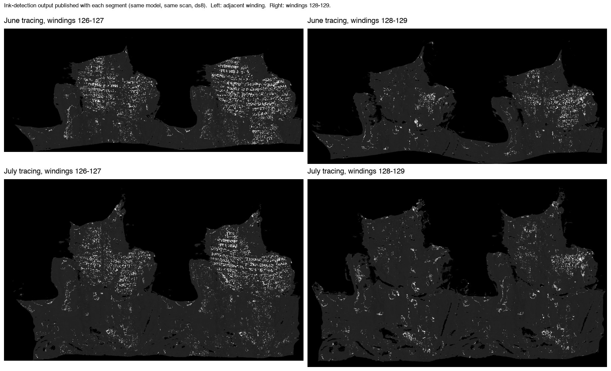
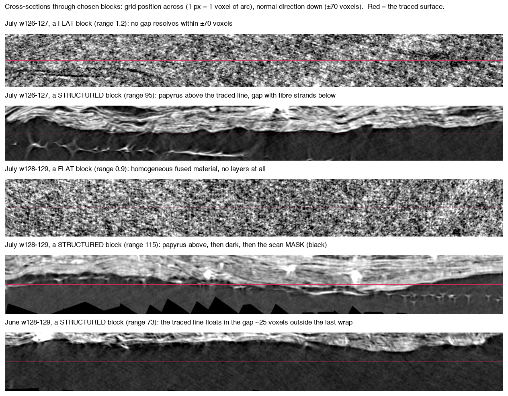

# Windings 128-129 of PHercParis4: what the published surfaces actually sit on

Two published surfaces, both tracings of windings 128-129 (June series
`20260623171929`, July series `20260701183151`), scored far below every other
surface on the scroll in the on-sheet pass. This document is the evidence for
what that means, gathered on 2 September, with two corrections to the framing
used before it was gathered.

## 1. Their ink model finds no text there, and finds text next door

Every published segment ships the team's own ink-detection render
(`ink-detection/downsampled/*-ds8.jpg`, model
`20260417190342-new_canon_autoresearch_recipe`). Same model, same scan:



Windings 126-127 show columns of legible Greek in both tracings. Windings
128-129 show speckle with no letterforms in both. Thumbnails and source keys are
in `onsheet/evidence/renders/`. This is the team's product, not ours.

## 2. Their surface volumes measure the same thing our sampler did

Every segment also ships `surface-volumes/*.zarr`: the scan resampled into a
109-layer band around the traced surface, one column per voxel. Reading 200
random 128x128 chunks per surface (about 3.2 million columns each) and taking
the range of each chunk's layer profile:

| series | seed | w128-129 median | w126-127 median | Mann-Whitney p |
|---|---|---|---|---|
| June | 0 | 14.1 | 43.1 | 3 x 10^-9 |
| June | 1 | 8.8 | 36.2 | 1 x 10^-6 |
| July | 0 | 17.1 | 28.1 | 0.023 |
| July | 1 | 15.1 | 28.1 | 0.0025 |

Replicated across seeds, on their sampler. The July neighbour is itself the
weaker of the two neighbours (28 against 36-43), and its ink render is
correspondingly fainter than the June neighbour's -- the measurement tracks
render quality even between two surfaces that both show text.

```
labelscope onsheet --surface-volume <w128-129 zarr> <w126-127 zarr> --chunks 200 --seed 0 --compare
```

## 3. What a "flat" block is, seen in the scan



Cross-sections through the flattest and most structured block of each surface
(`onsheet/evidence/xsec/`, rendered by `scripts/onsheet/xsec_block.py`) show
that **both kinds of block occur on both surfaces**:

* A *structured* block is the traced line riding the recto face of a sheet:
  layered papyrus on one side, a gap on the other, often with delaminated fibre
  strands in it. That is the recto-face convention the August entry measured
  (labels sit 2.3-2.6 voxels off the density maximum).
* A *flat* block is a region where **no gap resolves within +/-70 voxels of the
  surface**: homogeneous fibrous material, sheets fused to their neighbours.

On w128-129 there is a third thing. Its structured blocks show papyrus above
the traced line, a dark band below it, and then **the scan mask**. In the June
tracing the line floats in that dark band about 25 voxels outside the last
papyrus. **Windings 128-129 are the outermost wrap.** Both tracing series end
there because there is no sheet beyond it.

## Correction 1: "not on papyrus" was the wrong description

The earlier text (`terminal-patch-result.md`) called these surfaces
"not sitting on papyrus where their neighbours do". The cross-sections say
something more specific: over most of their area, these surfaces run through
the scroll's fused outer crust, where no separable recto face exists for a
tracer to follow, and at their edge they sit in the air outside the last wrap.
The tracer did not wander off a sheet; it was asked for windings that the scan
does not resolve as distinct sheets. The ink model then has nothing to read.

Whether a terminal patch like this should be published as "windings 128-129" is
the team's call, and is the question the issue asks.

## Correction 2: 24 blocks was far too few, and the first p-values were luck

The two surfaces are 3,500 x 7,700 grid cells. Our first comparison used 24
random 12x12 blocks -- 0.013% of the surface -- and reported p = 0.0031 and
p = 0.0043. A second draw of 24 blocks, laid as non-overlapping tiles, gave
p = 0.50 and p = 0.18 on the same surfaces.

Neither draw was wrong; the surfaces are heterogeneous. On healthy and
defective surfaces alike the per-block range runs from about 1 (fused) to about
80 (a clean recto face); they differ in the *fraction* that is flat. A median of
24 draws from that two-humped distribution is unstable by construction. The
numbers in section 2 replace the earlier ones: 200 chunks, 3.2 million columns,
two seeds, and the same direction and significance each time.

The tool now reports p10, median and p90 rather than a lone median, and reads
the team's surface volumes when they exist, which is about 300x cheaper per
column than walking the scan.

## What the entry claims, precisely

1. Both published w128-129 surfaces produce no text under the team's own ink
   model, while the adjacent winding produces legible columns (section 1).
2. A cheap measurement on the team's own surface volumes separates the two,
   replicated across seeds (section 2), and so can flag such surfaces before a
   GPU ink run rather than after.
3. The cause is that windings 128-129 are the fused outermost wrap of the
   scroll, not a tracing that stepped between sheets (section 3).

## Reproduce

`findings/onsheet/REPRODUCE.sh` fetches the four meshes and runs the
raw-scan comparison; the surface-volume command is in section 2; the
cross-sections come from `scripts/onsheet/xsec_block.py` with the block
coordinates in the image filenames.
